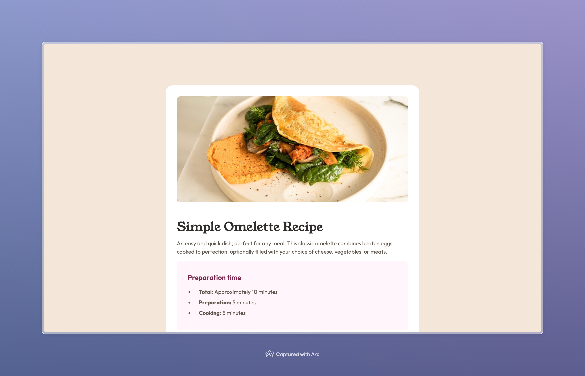

# Frontend Mentor - Recipe page solution

This is a solution to the [Recipe page challenge on Frontend Mentor](https://www.frontendmentor.io/challenges/recipe-page-KiTsR8QQKm). Frontend Mentor challenges help you improve your coding skills by building realistic projects.

## Table of contents

- [Overview](#overview)
  - [The challenge](#the-challenge)
  - [Screenshot](#screenshot)
  - [Links](#links)
- [My process](#my-process)
  - [Built with](#built-with)
- [Author](#author)

## Overview

### Screenshot

### Links

- Solution URL: [https://www.frontendmentor.io/solutions/recipe-page-with-html-and-css-cziySbhAut](https://www.frontendmentor.io/solutions/recipe-page-with-html-and-css-cziySbhAut)
- Live Site URL: [https://recipe-page-by-samuel-adu.vercel.app](https://recipe-page-by-samuel-adu.vercel.app)

## My process

### Built with

- Semantic HTML5 markup
- CSS custom properties
- Flexbox

## Author

- Website - [Samuel Adu](https://www.samueladu.dev)
- Frontend Mentor - [@samuel-adu](https://www.frontendmentor.io/profile/samuel-adu)
- Twitter - [@sxmueladu](https://www.twitter.com/sxmueladu)
